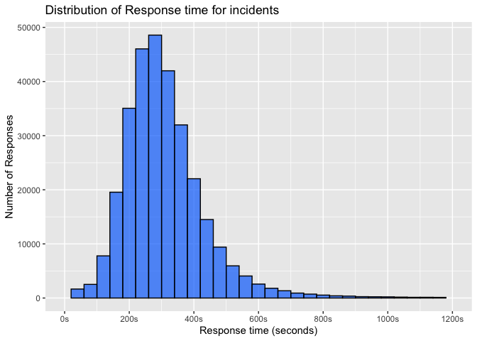
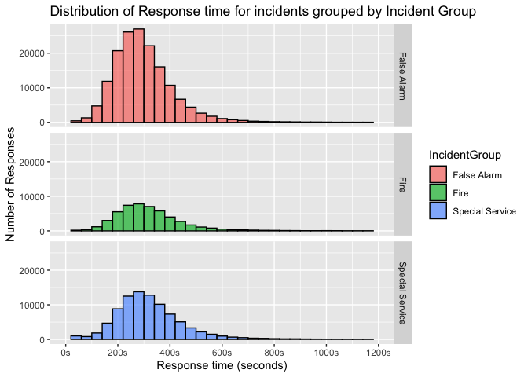
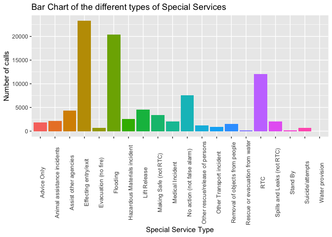
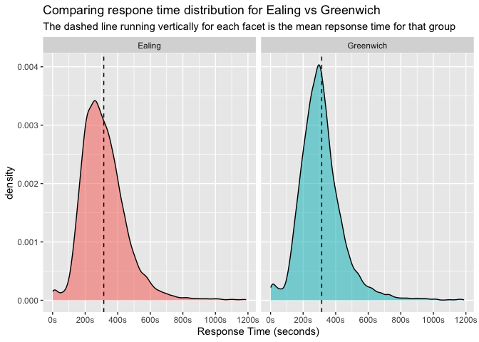
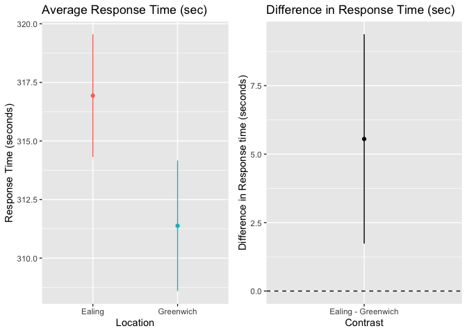

Analysis for London Fire Brigade
================
Ruthuparan Prasad

### Data Dictionary

The data is from the London Fire Brigade. All variables are described in
the table below.

| Variable                               | Description                                                      |
|----------------------------------------|------------------------------------------------------------------|
| IncidentNumber                         | LFB Incident Number                                              |
| DateOfCall                             | Date of call                                                     |
| CalYear                                | Year of call                                                     |
| TimeOfCall                             | Time of call                                                     |
| HourOfCall                             | Hour of call                                                     |
| IncidentGroup                          | High level incident category                                     |
| StopCodeDescription                    | Detailed incident category                                       |
| SpecialServiceType                     | Further detail for special services incident categories          |
| PropertyCategory                       | High level property descriptor                                   |
| PropertyType                           | Detailed property descriptor                                     |
| AddressQualifier                       | Qualifies location of actual incident relevant to category above |
| Postcode_full                          | Postcode                                                         |
| Postcode_district                      | Postcode Districts                                               |
| UPRN                                   | Unique Property Reference Number                                 |
| USRN                                   | Unique Street Reference Number                                   |
| IncGeo_BoroughCode                     | Borough Code                                                     |
| IncGeo_BoroughName                     | Borough Name                                                     |
| ProperCase                             | Borough Name                                                     |
| IncGeo_WardCode                        | Ward Code                                                        |
| IncGeo_WardName                        | Ward Name                                                        |
| IncGeo_WardNameNew                     | New Ward Name                                                    |
| Easting_m                              | Easting                                                          |
| Northing_m                             | Northing                                                         |
| Easting_rounded                        | Easting rounded up to nearest 50                                 |
| Northing_rounded                       | Northing rounded up to nearest 50                                |
| Latitude                               | Latitude                                                         |
| Longitude                              | Longitude                                                        |
| FRS                                    | Fire Service ground                                              |
| IncidentStationGround                  | LFB Station ground                                               |
| FirstPumpArriving_AttendanceTime       | First Pump attendance time in seconds                            |
| FirstPumpArriving_DeployedFromStation  | First Pump deployed from station                                 |
| SecondPumpArriving_AttendanceTime      | Second Pump attendance time in seconds                           |
| SecondPumpArriving_DeployedFromStation | Second Pump deployed from station                                |
| NumStationsWithPumpsAttending          | Number of stations with pumps in attendance                      |
| NumPumpsAttending                      | Number of pumps in attendance                                    |
| PumpCount                              | Number of pumps available                                        |
| PumpHoursRoundUp                       | Time spent at incident by pumps, rounded up to nearest hour      |
| Notional Cost (£)                      | Cost of service                                                  |
| NumCalls                               | Number of Calls                                                  |

# Section 1

#### Source of the data:

London Fire Brigade

#### Purpose of the analysis:

A panel of Fire service managers and politicians want to gain insights
on costs and response times associated with incidents during the time
period in the data.

``` r
# Adding the libraries we need
library(kableExtra)
library(emmeans)
library(gridExtra)
library(dplyr)
library(lubridate)
library(kableExtra)
library(tidyverse)
library(broom)
library(knitr)
options(width=100)
```

### Reading and cleaning the data

``` r
#reading the data
fire_df <- read_csv("London_Fire_data.csv", guess_max = 10000)
```

    ## Rows: 322375 Columns: 39
    ## ── Column specification ────────────────────────────────────────────────────────────────────────────
    ## Delimiter: ","
    ## chr  (20): IncidentNumber, DateOfCall, IncidentGroup, StopCodeDescription, SpecialServiceType, P...
    ## dbl  (18): CalYear, HourOfCall, UPRN, USRN, Easting_m, Northing_m, Easting_rounded, Northing_rou...
    ## time  (1): TimeOfCall
    ## 
    ## ℹ Use `spec()` to retrieve the full column specification for this data.
    ## ℹ Specify the column types or set `show_col_types = FALSE` to quiet this message.

``` r
#analysing the data by looking at the structure
str(fire_df)
```

    ## spc_tbl_ [322,375 × 39] (S3: spec_tbl_df/tbl_df/tbl/data.frame)
    ##  $ IncidentNumber                        : chr [1:322375] "000006-01012019" "000019-01012019" "000020-01012019" "000021-01012019" ...
    ##  $ DateOfCall                            : chr [1:322375] "01 Jan 2019" "01 Jan 2019" "01 Jan 2019" "01 Jan 2019" ...
    ##  $ CalYear                               : num [1:322375] 2019 2019 2019 2019 2019 ...
    ##  $ TimeOfCall                            : 'hms' num [1:322375] 00:01:45 00:04:33 00:04:39 00:04:44 ...
    ##   ..- attr(*, "units")= chr "secs"
    ##  $ HourOfCall                            : num [1:322375] 0 0 0 0 0 0 0 0 0 0 ...
    ##  $ IncidentGroup                         : chr [1:322375] "Special Service" "Fire" "False Alarm" "False Alarm" ...
    ##  $ StopCodeDescription                   : chr [1:322375] "Special Service" "Secondary Fire" "False alarm - Good intent" "AFA" ...
    ##  $ SpecialServiceType                    : chr [1:322375] "Lift Release" NA NA NA ...
    ##  $ PropertyCategory                      : chr [1:322375] "Dwelling" "Outdoor" "Outdoor" "Dwelling" ...
    ##  $ PropertyType                          : chr [1:322375] "Purpose Built Flats/Maisonettes - 4 to 9 storeys" "Tree scrub" "Domestic garden (vegetation not equipment)" "Stately Home (part not open to public)" ...
    ##  $ AddressQualifier                      : chr [1:322375] "Correct incident location" "On land associated with building" "In street outside gazetteer location" "Within same building" ...
    ##  $ Postcode_full                         : chr [1:322375] NA "N9 7HU" "N20 0BB" NA ...
    ##  $ Postcode_district                     : chr [1:322375] "SE11" "N9" "N20" "SW7" ...
    ##  $ UPRN                                  : num [1:322375] 0.00 2.07e+08 2.00e+08 0.00 0.00 ...
    ##  $ USRN                                  : num [1:322375] 21901674 20704497 20037660 8400731 22700484 ...
    ##  $ IncGeo_BoroughCode                    : chr [1:322375] "E09000022" "E09000010" "E09000003" "E09000033" ...
    ##  $ IncGeo_BoroughName                    : chr [1:322375] "LAMBETH" "ENFIELD" "BARNET" "WESTMINSTER" ...
    ##  $ ProperCase                            : chr [1:322375] "Lambeth" "Enfield" "Barnet" "Westminster" ...
    ##  $ IncGeo_WardCode                       : chr [1:322375] "E05000427" "E05000204" "E05000043" "E05000637" ...
    ##  $ IncGeo_WardName                       : chr [1:322375] "PRINCE'S" "LOWER EDMONTON" "BRUNSWICK PARK" "KNIGHTSBRIDGE AND BELGRAVIA" ...
    ##  $ IncGeo_WardNameNew                    : chr [1:322375] "PRINCE'S" "LOWER EDMONTON" "BRUNSWICK PARK" "KNIGHTSBRIDGE AND BELGRAVIA" ...
    ##  $ Easting_m                             : num [1:322375] NA 534494 527630 NA NA ...
    ##  $ Northing_m                            : num [1:322375] NA 194099 193922 NA NA ...
    ##  $ Easting_rounded                       : num [1:322375] 530850 534450 527650 526750 537250 ...
    ##  $ Northing_rounded                      : num [1:322375] 178650 194050 193950 179550 183250 ...
    ##  $ Latitude                              : num [1:322375] NA 51.6 51.6 NA NA ...
    ##  $ Longitude                             : num [1:322375] NA -0.0582 -0.1574 NA NA ...
    ##  $ FRS                                   : chr [1:322375] "London" "London" "London" "London" ...
    ##  $ IncidentStationGround                 : chr [1:322375] "Lambeth" "Edmonton" "Barnet" "Kensington" ...
    ##  $ FirstPumpArriving_AttendanceTime      : num [1:322375] NA 357 318 210 329 422 180 335 369 268 ...
    ##  $ FirstPumpArriving_DeployedFromStation : chr [1:322375] NA "Edmonton" "Southgate" "Kensington" ...
    ##  $ SecondPumpArriving_AttendanceTime     : num [1:322375] NA NA NA NA NA 520 NA NA 486 NA ...
    ##  $ SecondPumpArriving_DeployedFromStation: chr [1:322375] NA NA NA NA ...
    ##  $ NumStationsWithPumpsAttending         : num [1:322375] 1 1 1 1 1 2 1 1 2 1 ...
    ##  $ NumPumpsAttending                     : num [1:322375] 1 1 1 1 1 2 1 1 2 1 ...
    ##  $ PumpCount                             : num [1:322375] 1 1 1 1 1 2 1 1 4 1 ...
    ##  $ PumpHoursRoundUp                      : num [1:322375] 1 1 1 1 1 3 1 1 4 1 ...
    ##  $ Notional Cost (£)                     : num [1:322375] 333 333 333 333 333 ...
    ##  $ NumCalls                              : num [1:322375] 2 1 1 1 1 3 1 1 5 1 ...
    ##  - attr(*, "spec")=
    ##   .. cols(
    ##   ..   IncidentNumber = col_character(),
    ##   ..   DateOfCall = col_character(),
    ##   ..   CalYear = col_double(),
    ##   ..   TimeOfCall = col_time(format = ""),
    ##   ..   HourOfCall = col_double(),
    ##   ..   IncidentGroup = col_character(),
    ##   ..   StopCodeDescription = col_character(),
    ##   ..   SpecialServiceType = col_character(),
    ##   ..   PropertyCategory = col_character(),
    ##   ..   PropertyType = col_character(),
    ##   ..   AddressQualifier = col_character(),
    ##   ..   Postcode_full = col_character(),
    ##   ..   Postcode_district = col_character(),
    ##   ..   UPRN = col_double(),
    ##   ..   USRN = col_double(),
    ##   ..   IncGeo_BoroughCode = col_character(),
    ##   ..   IncGeo_BoroughName = col_character(),
    ##   ..   ProperCase = col_character(),
    ##   ..   IncGeo_WardCode = col_character(),
    ##   ..   IncGeo_WardName = col_character(),
    ##   ..   IncGeo_WardNameNew = col_character(),
    ##   ..   Easting_m = col_double(),
    ##   ..   Northing_m = col_double(),
    ##   ..   Easting_rounded = col_double(),
    ##   ..   Northing_rounded = col_double(),
    ##   ..   Latitude = col_double(),
    ##   ..   Longitude = col_double(),
    ##   ..   FRS = col_character(),
    ##   ..   IncidentStationGround = col_character(),
    ##   ..   FirstPumpArriving_AttendanceTime = col_double(),
    ##   ..   FirstPumpArriving_DeployedFromStation = col_character(),
    ##   ..   SecondPumpArriving_AttendanceTime = col_double(),
    ##   ..   SecondPumpArriving_DeployedFromStation = col_character(),
    ##   ..   NumStationsWithPumpsAttending = col_double(),
    ##   ..   NumPumpsAttending = col_double(),
    ##   ..   PumpCount = col_double(),
    ##   ..   PumpHoursRoundUp = col_double(),
    ##   ..   `Notional Cost (£)` = col_double(),
    ##   ..   NumCalls = col_double()
    ##   .. )
    ##  - attr(*, "problems")=<externalptr>

``` r
#analysing the data by looking at the summary
summary(fire_df)
```

    ##  IncidentNumber      DateOfCall           CalYear      TimeOfCall         HourOfCall   
    ##  Length:322375      Length:322375      Min.   :2019   Length:322375     Min.   : 0.00  
    ##  Class :character   Class :character   1st Qu.:2019   Class1:hms        1st Qu.: 9.00  
    ##  Mode  :character   Mode  :character   Median :2020   Class2:difftime   Median :14.00  
    ##                                        Mean   :2020   Mode  :numeric    Mean   :13.42  
    ##                                        3rd Qu.:2021                     3rd Qu.:19.00  
    ##                                        Max.   :2022                     Max.   :23.00  
    ##                                                                                        
    ##  IncidentGroup      StopCodeDescription SpecialServiceType PropertyCategory   PropertyType      
    ##  Length:322375      Length:322375       Length:322375      Length:322375      Length:322375     
    ##  Class :character   Class :character    Class :character   Class :character   Class :character  
    ##  Mode  :character   Mode  :character    Mode  :character   Mode  :character   Mode  :character  
    ##                                                                                                 
    ##                                                                                                 
    ##                                                                                                 
    ##                                                                                                 
    ##  AddressQualifier   Postcode_full      Postcode_district       UPRN                USRN         
    ##  Length:322375      Length:322375      Length:322375      Min.   :0.000e+00   Min.   : 4200740  
    ##  Class :character   Class :character   Class :character   1st Qu.:0.000e+00   1st Qu.:20400989  
    ##  Mode  :character   Mode  :character   Mode  :character   Median :0.000e+00   Median :21201121  
    ##                                                           Mean   :2.072e+10   Mean   :20400837  
    ##                                                           3rd Qu.:1.001e+10   3rd Qu.:22100813  
    ##                                                           Max.   :2.000e+11   Max.   :99990422  
    ##                                                                                                 
    ##  IncGeo_BoroughCode IncGeo_BoroughName  ProperCase        IncGeo_WardCode    IncGeo_WardName   
    ##  Length:322375      Length:322375      Length:322375      Length:322375      Length:322375     
    ##  Class :character   Class :character   Class :character   Class :character   Class :character  
    ##  Mode  :character   Mode  :character   Mode  :character   Mode  :character   Mode  :character  
    ##                                                                                                
    ##                                                                                                
    ##                                                                                                
    ##                                                                                                
    ##  IncGeo_WardNameNew   Easting_m        Northing_m     Easting_rounded  Northing_rounded
    ##  Length:322375      Min.   :503582   Min.   :155998   Min.   :503550   Min.   :155950  
    ##  Class :character   1st Qu.:524924   1st Qu.:175804   1st Qu.:525150   1st Qu.:176050  
    ##  Mode  :character   Median :530858   Median :180978   Median :530950   Median :181050  
    ##                     Mean   :530634   Mean   :180340   Mean   :530667   Mean   :180487  
    ##                     3rd Qu.:537035   3rd Qu.:185076   3rd Qu.:536350   3rd Qu.:185250  
    ##                     Max.   :560461   Max.   :200885   Max.   :611150   Max.   :302450  
    ##                     NA's   :175667   NA's   :175667                                    
    ##     Latitude        Longitude          FRS            IncidentStationGround
    ##  Min.   : 0.00    Min.   :-0.51    Length:322375      Length:322375        
    ##  1st Qu.:51.47    1st Qu.:-0.20    Class :character   Class :character     
    ##  Median :51.51    Median :-0.12    Mode  :character   Mode  :character     
    ##  Mean   :51.36    Mean   :-0.12                                            
    ##  3rd Qu.:51.55    3rd Qu.:-0.03                                            
    ##  Max.   :51.69    Max.   : 0.31                                            
    ##  NA's   :175667   NA's   :175667                                           
    ##  FirstPumpArriving_AttendanceTime FirstPumpArriving_DeployedFromStation
    ##  Min.   :   1.0                   Length:322375                        
    ##  1st Qu.: 227.0                   Class :character                     
    ##  Median : 290.5                   Mode  :character                     
    ##  Mean   : 308.1                                                        
    ##  3rd Qu.: 367.0                                                        
    ##  Max.   :1199.0                                                        
    ##  NA's   :19019                                                         
    ##  SecondPumpArriving_AttendanceTime SecondPumpArriving_DeployedFromStation
    ##  Min.   :   1.0                    Length:322375                         
    ##  1st Qu.: 293.0                    Class :character                      
    ##  Median : 363.0                    Mode  :character                      
    ##  Mean   : 385.6                                                          
    ##  3rd Qu.: 450.0                                                          
    ##  Max.   :1200.0                                                          
    ##  NA's   :199385                                                          
    ##  NumStationsWithPumpsAttending NumPumpsAttending   PumpCount       PumpHoursRoundUp 
    ##  Min.   : 1.0                  Min.   : 1.000    Min.   :  1.000   Min.   :   1.00  
    ##  1st Qu.: 1.0                  1st Qu.: 1.000    1st Qu.:  1.000   1st Qu.:   1.00  
    ##  Median : 1.0                  Median : 1.000    Median :  1.000   Median :   1.00  
    ##  Mean   : 1.4                  Mean   : 1.571    Mean   :  1.619   Mean   :   1.37  
    ##  3rd Qu.: 2.0                  3rd Qu.: 2.000    3rd Qu.:  2.000   3rd Qu.:   1.00  
    ##  Max.   :14.0                  Max.   :14.000    Max.   :250.000   Max.   :1203.00  
    ##  NA's   :3823                  NA's   :3823      NA's   :2008      NA's   :2111     
    ##  Notional Cost (£)     NumCalls      
    ##  Min.   :   333.0   Min.   :  1.000  
    ##  1st Qu.:   339.0   1st Qu.:  1.000  
    ##  Median :   346.0   Median :  1.000  
    ##  Mean   :   471.9   Mean   :  1.306  
    ##  3rd Qu.:   352.0   3rd Qu.:  1.000  
    ##  Max.   :407817.0   Max.   :175.000  
    ##  NA's   :2111       NA's   :4

``` r
#renaming the column Notional Cost (£) to Cost
names(fire_df)[names(fire_df) == "Notional Cost (£)"] <- "Cost"

#changing DateOfCall from character to Date type
fire_df$DateOfCall <- dmy(fire_df$DateOfCall)

#changing IncidentGroup, StopCodeDescription, SpecialServiceType and PropertyCategory to factors
cols <- c("IncidentGroup", "StopCodeDescription", "SpecialServiceType", "PropertyCategory")
fire_df[cols] <- lapply(fire_df[cols], as.factor)
```

Now that our data has been cleaned, we can move on to answering the
questions.

NOTE: We are not removing any NA values from the original dataset, we
will filter them out as and when required while performing calculations.

### The costs of responding to fires and false alarms

##### The sum of all costs associated with responding to fires during the time period

From the data available to us, we sum up all costs associated with
responding to fires, excluding any empty Cost records.

``` r
#Filtering out NA values and "Fire" values and then adding Costs 
sumOfFireCosts <- fire_df %>% filter(!is.na(Cost)) %>% filter(IncidentGroup == "Fire") %>% summarise(sum_of_fire_costs = sum(Cost))

colnames(sumOfFireCosts)[1] <- "Cost of responding to Fires in £"
(sumOfFireCosts %>% kbl(caption = "Table 1. Cost of Responding to Fires") %>% kable_styling(full_width  = F))
```

<table class="table" style="width: auto !important; margin-left: auto; margin-right: auto;">
<caption>
Table 1. Cost of Responding to Fires
</caption>
<thead>
<tr>
<th style="text-align:right;">
Cost of responding to Fires in £
</th>
</tr>
</thead>
<tbody>
<tr>
<td style="text-align:right;">
43059576
</td>
</tr>
</tbody>
</table>

##### The sum of all costs associated with responding to false alarms.

Sometimes, calls made to the London Fire Brigade turn out to be false
alarms. These could be calls from people who are genuinely concerned
about something they thought was a fire, or from people with bad
intentions, like playing a prank.

``` r
#Filtering out NA values and "False Alarm" values and then adding Costs 
sumOfFalseAlarmCosts <- fire_df %>% filter(IncidentGroup == "False Alarm") %>% filter(!is.na(Cost)) %>% summarise(sum_of_False_Alarm_costs = sum(Cost))

colnames(sumOfFalseAlarmCosts)[1] <- "Cost of responding to False Alarms in £"
(sumOfFalseAlarmCosts %>% kbl(caption = "Table 2. Cost of Responding to Fires") %>% kable_styling(full_width = F))
```

<table class="table" style="width: auto !important; margin-left: auto; margin-right: auto;">
<caption>
Table 2. Cost of Responding to Fires
</caption>
<thead>
<tr>
<th style="text-align:right;">
Cost of responding to False Alarms in £
</th>
</tr>
</thead>
<tbody>
<tr>
<td style="text-align:right;">
61249812
</td>
</tr>
</tbody>
</table>

##### The average cost of responding to a fire, and of responding to a false alarm.

The average cost of responding to a fire is £837.98 and the average cost
of responding to a false alarm is £378.38.

``` r
#Finding avg. cost of "Fire" and "False Alarm"
avg_costs <- fire_df %>% group_by(IncidentGroup) %>% filter(IncidentGroup != "Special Service") %>% filter(!is.na(Cost)) %>% summarise(avg_cost = round(mean(Cost),2)) %>% as.data.frame()

names(avg_costs)[names(avg_costs) == "IncidentGroup"] <- "Incident Group"
names(avg_costs)[names(avg_costs) == "avg_cost"] <- "Average Cost in £"
avg_costs$`Average Cost in £` <- round(avg_costs$`Average Cost in £`, 2)
(avg_costs %>% kbl(caption = "Table 3. Average Cost of Responding to Fire vs False Alarm") %>% kable_styling(full_width = F))
```

<table class="table" style="width: auto !important; margin-left: auto; margin-right: auto;">
<caption>
Table 3. Average Cost of Responding to Fire vs False Alarm
</caption>
<thead>
<tr>
<th style="text-align:left;">
Incident Group
</th>
<th style="text-align:right;">
Average Cost in £
</th>
</tr>
</thead>
<tbody>
<tr>
<td style="text-align:left;">
False Alarm
</td>
<td style="text-align:right;">
378.38
</td>
</tr>
<tr>
<td style="text-align:left;">
Fire
</td>
<td style="text-align:right;">
837.98
</td>
</tr>
</tbody>
</table>

### The distribution of response times

##### Response times to all incidents where there was indeed a response.

``` r
#Plotting a histogram to visualise distribution of response time
response_distribution <- fire_df %>% ggplot(aes(x = FirstPumpArriving_AttendanceTime)) + geom_histogram(color = "black", fill = "#0373fc", binwidth = 40, alpha = 0.7, na.rm = TRUE) + scale_x_continuous(limit = c(0,1200), 
                         breaks = c(0,200,400, 600, 800, 1000, 1200), 
                         labels = c("0s","200s","400s","600s", "800s","1000s", "1200s"))  + labs(title = "Distribution of Response time for incidents" , x ="Response time (seconds)", y = "Number of Responses")

(
  fire_df %>% filter(!is.na(FirstPumpArriving_AttendanceTime)) %>% 
  summarise("Min. Time Taken to Respond (seconds)" = min(FirstPumpArriving_AttendanceTime),"Max. Time Taken to Respond (seconds)" = max(FirstPumpArriving_AttendanceTime), "Avg. Time Taken to Respond (seconds)" = mean(FirstPumpArriving_AttendanceTime)) %>%
  kbl(caption = "Table 4. Response Time Statistics") %>% kable_styling(full_width = F)
  )
```

<table class="table" style="width: auto !important; margin-left: auto; margin-right: auto;">
<caption>
Table 4. Response Time Statistics
</caption>
<thead>
<tr>
<th style="text-align:right;">
Min. Time Taken to Respond (seconds)
</th>
<th style="text-align:right;">
Max. Time Taken to Respond (seconds)
</th>
<th style="text-align:right;">
Avg. Time Taken to Respond (seconds)
</th>
</tr>
</thead>
<tbody>
<tr>
<td style="text-align:right;">
1
</td>
<td style="text-align:right;">
1199
</td>
<td style="text-align:right;">
308.0578
</td>
</tr>
</tbody>
</table>

``` r
response_distribution
```



On analysing the time taken to respond, we see that the least amount of
time taken is 1 second and the maximum amount of time taken is 1199
seconds, which is approximately 20 minutes. However, on average it takes
around 5 minutes to respond to a call. This data is in accordance with
the graph, with a big chunk of responses taking between 200-400 seconds.

##### Compare the distribution of response times for the three different types of incidents.

We have 3 high-level incident categories - Fire, False Alarms and
Special Services. We are comparing the response times for the different
types.

``` r
#Printing a summary table of min, max and mean values for all types of incidents
dist_details_incident_group <- fire_df %>% filter(!is.na(FirstPumpArriving_AttendanceTime)) %>% group_by(IncidentGroup) %>% summarise(min_val = min(FirstPumpArriving_AttendanceTime), max_val = max(FirstPumpArriving_AttendanceTime), mean_val = mean(FirstPumpArriving_AttendanceTime)) %>% as.data.frame()


colnames(dist_details_incident_group)[1] <- "Incident Group"
colnames(dist_details_incident_group)[2] <- "Min. Response Time (seconds)"
colnames(dist_details_incident_group)[3] <- "Max. Response Time (seconds)"
colnames(dist_details_incident_group)[4] <- "Avg. Response Time (seconds)"
temp <- fire_df %>% group_by(IncidentGroup) %>% filter(!is.na(IncidentGroup)) %>% count()
dist_details_incident_group$`Total Count` <- temp$n

(dist_details_incident_group %>% kbl(caption = "Table 5. Response Time Statistics by Group ") %>% kable_styling(full_width = F))
```

<table class="table" style="width: auto !important; margin-left: auto; margin-right: auto;">
<caption>
Table 5. Response Time Statistics by Group
</caption>
<thead>
<tr>
<th style="text-align:left;">
Incident Group
</th>
<th style="text-align:right;">
Min. Response Time (seconds)
</th>
<th style="text-align:right;">
Max. Response Time (seconds)
</th>
<th style="text-align:right;">
Avg. Response Time (seconds)
</th>
<th style="text-align:right;">
Total Count
</th>
</tr>
</thead>
<tbody>
<tr>
<td style="text-align:left;">
False Alarm
</td>
<td style="text-align:right;">
1
</td>
<td style="text-align:right;">
1199
</td>
<td style="text-align:right;">
298.9196
</td>
<td style="text-align:right;">
162299
</td>
</tr>
<tr>
<td style="text-align:left;">
Fire
</td>
<td style="text-align:right;">
1
</td>
<td style="text-align:right;">
1199
</td>
<td style="text-align:right;">
319.4506
</td>
<td style="text-align:right;">
51443
</td>
</tr>
<tr>
<td style="text-align:left;">
Special Service
</td>
<td style="text-align:right;">
1
</td>
<td style="text-align:right;">
1196
</td>
<td style="text-align:right;">
317.8027
</td>
<td style="text-align:right;">
108633
</td>
</tr>
</tbody>
</table>

``` r
#Plotting a histogram to visualise distribution of response time for Fire, Special Service, False Alarm

response_distribution_by_group <- fire_df %>% ggplot(aes(x = FirstPumpArriving_AttendanceTime)) + geom_histogram(color = "black", binwidth = 40, alpha = 0.7, na.rm = TRUE) + scale_x_continuous(limit = c(0,1200), breaks = c(0,200,400, 600, 800, 1000, 1200),labels = c("0s","200s","400s","600s", "800s","1000s", "1200s"))  + labs(title = "Distribution of Response time for incidents grouped by Incident Group" , x ="Response time (seconds)", y = "Number of Responses") + facet_grid(IncidentGroup~.) + aes(fill = IncidentGroup)

response_distribution_by_group 
```



We can see that all of them have the same minimum response time. The
maximum response time, although different, is approximately 20 minutes
for all groups. However, the average time taken to respond is different
for the Incident Groups On average, the response time is fastest for
false alarms, followed by special services and then fires. We can also
see from the graph and table that there are more calls for false alarms
than other groups In fact, fires have the least count of all the types.

### Summary of special service response times

##### Count of the number of each type of incident

``` r
#counting occurrence of each type of incident
count_of_incidents <- fire_df %>% filter(!is.na(SpecialServiceType)) %>% group_by(SpecialServiceType) %>% summarise(total_count =n())

colnames(count_of_incidents)[1] <- "Special Service Type"
colnames(count_of_incidents)[2] <- "Count"      
(count_of_incidents %>% kbl(caption = "Table 6. Count of Special Service Types") %>% kable_styling(full_width = F))
```

<table class="table" style="width: auto !important; margin-left: auto; margin-right: auto;">
<caption>
Table 6. Count of Special Service Types
</caption>
<thead>
<tr>
<th style="text-align:left;">
Special Service Type
</th>
<th style="text-align:right;">
Count
</th>
</tr>
</thead>
<tbody>
<tr>
<td style="text-align:left;">
Advice Only
</td>
<td style="text-align:right;">
1867
</td>
</tr>
<tr>
<td style="text-align:left;">
Animal assistance incidents
</td>
<td style="text-align:right;">
2300
</td>
</tr>
<tr>
<td style="text-align:left;">
Assist other agencies
</td>
<td style="text-align:right;">
4529
</td>
</tr>
<tr>
<td style="text-align:left;">
Effecting entry/exit
</td>
<td style="text-align:right;">
24142
</td>
</tr>
<tr>
<td style="text-align:left;">
Evacuation (no fire)
</td>
<td style="text-align:right;">
667
</td>
</tr>
<tr>
<td style="text-align:left;">
Flooding
</td>
<td style="text-align:right;">
22853
</td>
</tr>
<tr>
<td style="text-align:left;">
Hazardous Materials incident
</td>
<td style="text-align:right;">
2547
</td>
</tr>
<tr>
<td style="text-align:left;">
Lift Release
</td>
<td style="text-align:right;">
15534
</td>
</tr>
<tr>
<td style="text-align:left;">
Making Safe (not RTC)
</td>
<td style="text-align:right;">
3408
</td>
</tr>
<tr>
<td style="text-align:left;">
Medical Incident
</td>
<td style="text-align:right;">
2190
</td>
</tr>
<tr>
<td style="text-align:left;">
No action (not false alarm)
</td>
<td style="text-align:right;">
9277
</td>
</tr>
<tr>
<td style="text-align:left;">
Other rescue/release of persons
</td>
<td style="text-align:right;">
1218
</td>
</tr>
<tr>
<td style="text-align:left;">
Other Transport incident
</td>
<td style="text-align:right;">
887
</td>
</tr>
<tr>
<td style="text-align:left;">
Removal of objects from people
</td>
<td style="text-align:right;">
1601
</td>
</tr>
<tr>
<td style="text-align:left;">
Rescue or evacuation from water
</td>
<td style="text-align:right;">
204
</td>
</tr>
<tr>
<td style="text-align:left;">
RTC
</td>
<td style="text-align:right;">
12309
</td>
</tr>
<tr>
<td style="text-align:left;">
Spills and Leaks (not RTC)
</td>
<td style="text-align:right;">
2086
</td>
</tr>
<tr>
<td style="text-align:left;">
Stand By
</td>
<td style="text-align:right;">
160
</td>
</tr>
<tr>
<td style="text-align:left;">
Suicide/attempts
</td>
<td style="text-align:right;">
818
</td>
</tr>
<tr>
<td style="text-align:left;">
Water provision
</td>
<td style="text-align:right;">
1
</td>
</tr>
</tbody>
</table>

``` r
#plotting a bar chart to display count categorised by incident type

(
  fire_df %>% filter(!is.na(SpecialServiceType)) %>% filter(!is.na(FirstPumpArriving_AttendanceTime)) %>% group_by(SpecialServiceType) %>%
    ggplot(aes(x = SpecialServiceType, fill = SpecialServiceType)) + geom_bar() + theme(axis.text.x = element_text(angle = 90), legend.position = "none") + labs(title = "Bar Chart of the different types of Special Services" , x = "Special Service Type", y = "Number of calls")
)
```



Here, we can see that Effecting Entry/Exit has the highest count of all
Special Service types. The 4 most common Special Service types are
Effecting Entry/Exit, Flooding, Lift Release, and RTC (which stands for
Road Traffic Collision.) In contrast, there has only been one call for
Water Provision.

##### The mean response time for each type of incident

``` r
#calculating the avg response time for each incident type
mean_response_time_by_incident <- fire_df %>% filter(!is.na(SpecialServiceType)) %>% group_by(SpecialServiceType) %>% summarise_at(vars(FirstPumpArriving_AttendanceTime), list("mean_response_time_in_seconds" = mean), na.rm=TRUE) %>% as.data.frame()

mean_response_time_by_incident$mean_response_time_in_seconds <- round(mean_response_time_by_incident$mean_response_time_in_seconds, 2)

colnames(mean_response_time_by_incident)[1] <- "Special Service Type"
colnames(mean_response_time_by_incident)[2] <- "Avg. Response Time (seconds)"
(mean_response_time_by_incident %>% kbl(caption = "Table 7. Mean Response Time for Special Service types") %>% kable_styling(full_width = F))
```

<table class="table" style="width: auto !important; margin-left: auto; margin-right: auto;">
<caption>
Table 7. Mean Response Time for Special Service types
</caption>
<thead>
<tr>
<th style="text-align:left;">
Special Service Type
</th>
<th style="text-align:right;">
Avg. Response Time (seconds)
</th>
</tr>
</thead>
<tbody>
<tr>
<td style="text-align:left;">
Advice Only
</td>
<td style="text-align:right;">
319.95
</td>
</tr>
<tr>
<td style="text-align:left;">
Animal assistance incidents
</td>
<td style="text-align:right;">
341.17
</td>
</tr>
<tr>
<td style="text-align:left;">
Assist other agencies
</td>
<td style="text-align:right;">
316.79
</td>
</tr>
<tr>
<td style="text-align:left;">
Effecting entry/exit
</td>
<td style="text-align:right;">
317.12
</td>
</tr>
<tr>
<td style="text-align:left;">
Evacuation (no fire)
</td>
<td style="text-align:right;">
326.87
</td>
</tr>
<tr>
<td style="text-align:left;">
Flooding
</td>
<td style="text-align:right;">
327.96
</td>
</tr>
<tr>
<td style="text-align:left;">
Hazardous Materials incident
</td>
<td style="text-align:right;">
315.55
</td>
</tr>
<tr>
<td style="text-align:left;">
Lift Release
</td>
<td style="text-align:right;">
306.59
</td>
</tr>
<tr>
<td style="text-align:left;">
Making Safe (not RTC)
</td>
<td style="text-align:right;">
321.34
</td>
</tr>
<tr>
<td style="text-align:left;">
Medical Incident
</td>
<td style="text-align:right;">
222.16
</td>
</tr>
<tr>
<td style="text-align:left;">
No action (not false alarm)
</td>
<td style="text-align:right;">
327.65
</td>
</tr>
<tr>
<td style="text-align:left;">
Other rescue/release of persons
</td>
<td style="text-align:right;">
330.78
</td>
</tr>
<tr>
<td style="text-align:left;">
Other Transport incident
</td>
<td style="text-align:right;">
317.67
</td>
</tr>
<tr>
<td style="text-align:left;">
Removal of objects from people
</td>
<td style="text-align:right;">
207.85
</td>
</tr>
<tr>
<td style="text-align:left;">
Rescue or evacuation from water
</td>
<td style="text-align:right;">
324.22
</td>
</tr>
<tr>
<td style="text-align:left;">
RTC
</td>
<td style="text-align:right;">
318.15
</td>
</tr>
<tr>
<td style="text-align:left;">
Spills and Leaks (not RTC)
</td>
<td style="text-align:right;">
350.32
</td>
</tr>
<tr>
<td style="text-align:left;">
Stand By
</td>
<td style="text-align:right;">
309.31
</td>
</tr>
<tr>
<td style="text-align:left;">
Suicide/attempts
</td>
<td style="text-align:right;">
322.90
</td>
</tr>
<tr>
<td style="text-align:left;">
Water provision
</td>
<td style="text-align:right;">
245.00
</td>
</tr>
</tbody>
</table>

On average, most services take 308.47 seconds, approximately 5 minutes,
for responding to a Special Service. From the table above, we can see
that Spills and Leaks take the most time for a response and Removal of
Objects from people requires the least amount of time for a response.

##### The 10th percentile of response times for each type of incident

``` r
#calculating 10th percentile of response times for each type of incident
quantiles_by_incident_10 <- fire_df %>% filter(!is.na(SpecialServiceType)) %>% group_by(SpecialServiceType) %>% summarise("10th_percentile" = quantile(FirstPumpArriving_AttendanceTime, probs = c(0.10), na.rm = TRUE)) %>% as.data.frame()

colnames(quantiles_by_incident_10)[1] <- "Special Service Type"
colnames(quantiles_by_incident_10)[2] <- "10th Percentiles"
(quantiles_by_incident_10 %>% kbl(caption = "Table 8. 10th Percentile Response Times by Special Service Type") %>% kable_styling(full_width = F))
```

<table class="table" style="width: auto !important; margin-left: auto; margin-right: auto;">
<caption>
Table 8. 10th Percentile Response Times by Special Service Type
</caption>
<thead>
<tr>
<th style="text-align:left;">
Special Service Type
</th>
<th style="text-align:right;">
10th Percentiles
</th>
</tr>
</thead>
<tbody>
<tr>
<td style="text-align:left;">
Advice Only
</td>
<td style="text-align:right;">
188.0
</td>
</tr>
<tr>
<td style="text-align:left;">
Animal assistance incidents
</td>
<td style="text-align:right;">
190.0
</td>
</tr>
<tr>
<td style="text-align:left;">
Assist other agencies
</td>
<td style="text-align:right;">
182.0
</td>
</tr>
<tr>
<td style="text-align:left;">
Effecting entry/exit
</td>
<td style="text-align:right;">
182.0
</td>
</tr>
<tr>
<td style="text-align:left;">
Evacuation (no fire)
</td>
<td style="text-align:right;">
192.5
</td>
</tr>
<tr>
<td style="text-align:left;">
Flooding
</td>
<td style="text-align:right;">
191.0
</td>
</tr>
<tr>
<td style="text-align:left;">
Hazardous Materials incident
</td>
<td style="text-align:right;">
185.0
</td>
</tr>
<tr>
<td style="text-align:left;">
Lift Release
</td>
<td style="text-align:right;">
178.0
</td>
</tr>
<tr>
<td style="text-align:left;">
Making Safe (not RTC)
</td>
<td style="text-align:right;">
177.0
</td>
</tr>
<tr>
<td style="text-align:left;">
Medical Incident
</td>
<td style="text-align:right;">
8.0
</td>
</tr>
<tr>
<td style="text-align:left;">
No action (not false alarm)
</td>
<td style="text-align:right;">
188.0
</td>
</tr>
<tr>
<td style="text-align:left;">
Other rescue/release of persons
</td>
<td style="text-align:right;">
190.5
</td>
</tr>
<tr>
<td style="text-align:left;">
Other Transport incident
</td>
<td style="text-align:right;">
150.7
</td>
</tr>
<tr>
<td style="text-align:left;">
Removal of objects from people
</td>
<td style="text-align:right;">
7.0
</td>
</tr>
<tr>
<td style="text-align:left;">
Rescue or evacuation from water
</td>
<td style="text-align:right;">
175.9
</td>
</tr>
<tr>
<td style="text-align:left;">
RTC
</td>
<td style="text-align:right;">
157.0
</td>
</tr>
<tr>
<td style="text-align:left;">
Spills and Leaks (not RTC)
</td>
<td style="text-align:right;">
195.2
</td>
</tr>
<tr>
<td style="text-align:left;">
Stand By
</td>
<td style="text-align:right;">
164.9
</td>
</tr>
<tr>
<td style="text-align:left;">
Suicide/attempts
</td>
<td style="text-align:right;">
181.0
</td>
</tr>
<tr>
<td style="text-align:left;">
Water provision
</td>
<td style="text-align:right;">
245.0
</td>
</tr>
</tbody>
</table>

When we say something is the nth percentile, it means that there are n%
of values lesser than this cutoff point. In this scenario, we have
calculated the 10th percentile of response time for each of the Special
Service Types. This means that for each of these values in the table
above, 10% of all response times are lesser and 90% of response time
values are greater.  
\##### The 90th percentile of response times for each type of incident

``` r
#calculating 90th percentile of response times for each type of incident
quantiles_by_incident_90 <- fire_df %>% filter(!is.na(SpecialServiceType)) %>% group_by(SpecialServiceType) %>% 
  summarise("90th_percentile" = quantile(FirstPumpArriving_AttendanceTime, probs = c(0.90), na.rm = TRUE)) %>% as.data.frame()

colnames(quantiles_by_incident_90)[1] <- "Special Service Type"
colnames(quantiles_by_incident_90)[2] <- "90th Percentiles"
(quantiles_by_incident_90 %>% kbl(caption = "Table 9. 90th Percentile Response Times by Special Service Type") %>% kable_styling(full_width = F))
```

<table class="table" style="width: auto !important; margin-left: auto; margin-right: auto;">
<caption>
Table 9. 90th Percentile Response Times by Special Service Type
</caption>
<thead>
<tr>
<th style="text-align:left;">
Special Service Type
</th>
<th style="text-align:right;">
90th Percentiles
</th>
</tr>
</thead>
<tbody>
<tr>
<td style="text-align:left;">
Advice Only
</td>
<td style="text-align:right;">
462.4
</td>
</tr>
<tr>
<td style="text-align:left;">
Animal assistance incidents
</td>
<td style="text-align:right;">
517.4
</td>
</tr>
<tr>
<td style="text-align:left;">
Assist other agencies
</td>
<td style="text-align:right;">
462.0
</td>
</tr>
<tr>
<td style="text-align:left;">
Effecting entry/exit
</td>
<td style="text-align:right;">
470.0
</td>
</tr>
<tr>
<td style="text-align:left;">
Evacuation (no fire)
</td>
<td style="text-align:right;">
473.5
</td>
</tr>
<tr>
<td style="text-align:left;">
Flooding
</td>
<td style="text-align:right;">
485.0
</td>
</tr>
<tr>
<td style="text-align:left;">
Hazardous Materials incident
</td>
<td style="text-align:right;">
463.3
</td>
</tr>
<tr>
<td style="text-align:left;">
Lift Release
</td>
<td style="text-align:right;">
450.0
</td>
</tr>
<tr>
<td style="text-align:left;">
Making Safe (not RTC)
</td>
<td style="text-align:right;">
494.0
</td>
</tr>
<tr>
<td style="text-align:left;">
Medical Incident
</td>
<td style="text-align:right;">
433.0
</td>
</tr>
<tr>
<td style="text-align:left;">
No action (not false alarm)
</td>
<td style="text-align:right;">
485.0
</td>
</tr>
<tr>
<td style="text-align:left;">
Other rescue/release of persons
</td>
<td style="text-align:right;">
482.0
</td>
</tr>
<tr>
<td style="text-align:left;">
Other Transport incident
</td>
<td style="text-align:right;">
491.0
</td>
</tr>
<tr>
<td style="text-align:left;">
Removal of objects from people
</td>
<td style="text-align:right;">
456.0
</td>
</tr>
<tr>
<td style="text-align:left;">
Rescue or evacuation from water
</td>
<td style="text-align:right;">
483.7
</td>
</tr>
<tr>
<td style="text-align:left;">
RTC
</td>
<td style="text-align:right;">
500.0
</td>
</tr>
<tr>
<td style="text-align:left;">
Spills and Leaks (not RTC)
</td>
<td style="text-align:right;">
530.0
</td>
</tr>
<tr>
<td style="text-align:left;">
Stand By
</td>
<td style="text-align:right;">
471.8
</td>
</tr>
<tr>
<td style="text-align:left;">
Suicide/attempts
</td>
<td style="text-align:right;">
482.0
</td>
</tr>
<tr>
<td style="text-align:left;">
Water provision
</td>
<td style="text-align:right;">
245.0
</td>
</tr>
</tbody>
</table>

Building on what was discussed previously, these values represent the
90th percentile of response time. This means that there are only 10% of
values that are greater and 90% of all values lower than each of these
values in the table.

### A t-test comparing Ealing and Greenwich

A t-test is a statistical test used to check if there is a significant
difference between the means of two variables.

##### T-test using Null Hypothesis Significance Testing

We obtain the mean response time in Ealing as 316.93 seconds and the
mean response time in Greenwich as 311.38 seconds. On analysing the
confidence interval, we can conclude that 95% of the time, the
difference in the average response times in Ealing and Greenwich will
fall between \[1.74, 9.37\]. Most importantly, we can see the low
probability (p-value) that implies that the difference in their average
response time being zero is highly unlikely. Hence, we can reject the
null hypothesis.

``` r
#T-test using Null Hypothesis Significance Testing

t.test(FirstPumpArriving_AttendanceTime~ProperCase, data = filter(fire_df, ProperCase %in% c("Ealing", "Greenwich")))
```

    ## 
    ##  Welch Two Sample t-test
    ## 
    ## data:  FirstPumpArriving_AttendanceTime by ProperCase
    ## t = 2.8542, df = 19303, p-value = 0.00432
    ## alternative hypothesis: true difference in means between group Ealing and group Greenwich is not equal to 0
    ## 95 percent confidence interval:
    ##  1.739777 9.368041
    ## sample estimates:
    ##    mean in group Ealing mean in group Greenwich 
    ##                316.9342                311.3803

``` r
#Plotting the density curves for both Ealing and Greenwich
(
  mean_plot_ealing_greenwich <- fire_df %>% filter(ProperCase == "Ealing" | ProperCase == "Greenwich") %>% filter(!is.na(FirstPumpArriving_AttendanceTime)) %>% ggplot(aes(x = FirstPumpArriving_AttendanceTime, fill = ProperCase, alpha = 0.7)) + geom_density() + geom_vline(colour = "#000000", linetype = "dashed", aes(xintercept = mean(FirstPumpArriving_AttendanceTime,  na.rm = T))) + facet_wrap(~ProperCase) + theme(legend.position="none") + labs(x = "Response Time (seconds)", title = "Comparing respone time distribution for Ealing vs Greenwich", subtitle = "The dashed line running vertically for each facet is the mean repsonse time for that group") + scale_x_continuous(breaks = c(0,200,400, 600, 800, 1000, 1200),labels = c("0s","200s","400s","600s", "800s","1000s", "1200s")) 
)
```



##### T-test using Estimation

The estimation approach is a more modern approach in estimating values
of a large sample based on a smaller sample of the data. This method
does not depend on the sample size and is hence preferred over the Null
Hypothesis Significance Testing.

``` r
emm_options(opt.digits = FALSE)

#Comparing means by using estimation approach 
response_time_estimation <- lm(FirstPumpArriving_AttendanceTime~ProperCase, data = filter(fire_df, ProperCase %in% c("Ealing", "Greenwich")))

response_time_emm <- emmeans(response_time_estimation, ~ProperCase)

#using confint function to analyse confidence intervals
ealing_greenwich_contrast <- confint(pairs(response_time_emm))

response_time_emm %>% kbl(caption = "Table 10. Results of Estimation" ) %>% kable_styling(full_width = F)
```

<table class="table" style="width: auto !important; margin-left: auto; margin-right: auto;">
<caption>
Table 10. Results of Estimation
</caption>
<thead>
<tr>
<th style="text-align:left;">
ProperCase
</th>
<th style="text-align:right;">
emmean
</th>
<th style="text-align:right;">
SE
</th>
<th style="text-align:right;">
df
</th>
<th style="text-align:right;">
lower.CL
</th>
<th style="text-align:right;">
upper.CL
</th>
</tr>
</thead>
<tbody>
<tr>
<td style="text-align:left;">
Ealing
</td>
<td style="text-align:right;">
316.9342
</td>
<td style="text-align:right;">
1.335966
</td>
<td style="text-align:right;">
19445
</td>
<td style="text-align:right;">
314.3156
</td>
<td style="text-align:right;">
319.5528
</td>
</tr>
<tr>
<td style="text-align:left;">
Greenwich
</td>
<td style="text-align:right;">
311.3803
</td>
<td style="text-align:right;">
1.421039
</td>
<td style="text-align:right;">
19445
</td>
<td style="text-align:right;">
308.5950
</td>
<td style="text-align:right;">
314.1657
</td>
</tr>
</tbody>
</table>

``` r
ealing_greenwich_contrast %>% kbl(caption = "Table 11. Confidence Interval Results" ) %>% kable_styling(full_width = F)
```

<table class="table" style="width: auto !important; margin-left: auto; margin-right: auto;">
<caption>
Table 11. Confidence Interval Results
</caption>
<thead>
<tr>
<th style="text-align:left;">
contrast
</th>
<th style="text-align:right;">
estimate
</th>
<th style="text-align:right;">
SE
</th>
<th style="text-align:right;">
df
</th>
<th style="text-align:right;">
lower.CL
</th>
<th style="text-align:right;">
upper.CL
</th>
</tr>
</thead>
<tbody>
<tr>
<td style="text-align:left;">
Ealing - Greenwich
</td>
<td style="text-align:right;">
5.553909
</td>
<td style="text-align:right;">
1.950425
</td>
<td style="text-align:right;">
19445
</td>
<td style="text-align:right;">
1.730909
</td>
<td style="text-align:right;">
9.376909
</td>
</tr>
</tbody>
</table>

``` r
#plotting the results of estimation approach
grid.arrange ( 
  estimation_plot <- ggplot(summary(response_time_emm), aes(x=ProperCase, y=emmean, ymin=lower.CL, ymax=upper.CL)) + 
        geom_point(aes(colour = ProperCase)) + geom_linerange(aes(colour = ProperCase)) + labs(y="Response Time (seconds)", x="Location", title="Average Response Time (sec)") + theme(legend.position = "None"), 
  contrast_plot <- ggplot(ealing_greenwich_contrast, aes(x = contrast, y = estimate , ymin = lower.CL, ymax = upper.CL )) + geom_point() + geom_linerange() + labs(y = "Difference in Response time (seconds)", x = "Contrast", title = "Difference in Response Time (sec)") + geom_hline(yintercept = 0, lty = 2), ncol = 2
)
```



By analysing the results of the estimation approach, we can see the mean
value for Ealing is 316.93 seconds and Greenwich is 311.38 seconds.
Additionally, the chart on the left displays the range of the mean
response time that can be expected for each location, and the chart on
the right displays the range of difference in response time for the two
locations.

We can estimate that the difference in mean response time between Ealing
and Greenwich is 5.55 and be 95% confident that the true population mean
lies between \[1.73, 9.37\].
