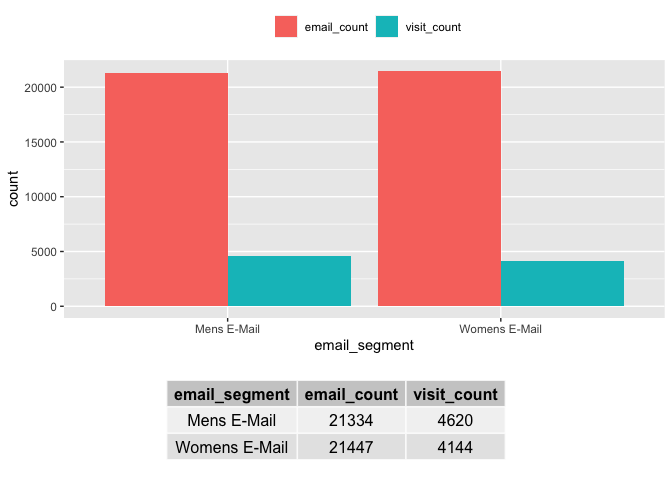
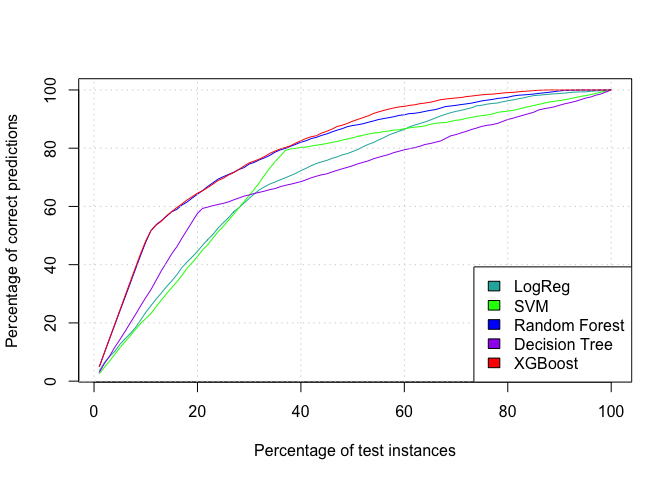

Universal Plus - Email Marketing Campaign
================
Ruthuparan Prasad
2022-11-26

``` r
# List of all packages that need to be used

package_list <- c("tidyverse", "readr", "dplyr", "caTools", "ggplot2", "caret", "Matrix", "xgboost", "pROC", "CustomerScoringMetrics", "e1071", "randomForest", "ROSE", "party", "MASS", "tree", "maptree", "ROCR", "gridExtra", "kableExtra", "patchwork", "rmarkdown")

# Install them if not installed

installed_packages <- package_list %in% rownames(installed.packages())
if (any(installed_packages == FALSE)) {
  install.packages(package_list[!installed_packages])
}

# Load the packages 

invisible(lapply(package_list, library, character.only = TRUE))
```

``` r
# Loading the .RData file to make sure all saved variables are available 

load(".RData")
```

``` r
# Business Understanding

# Reading the data to understand current scenario and performance

emaildata <- read.csv("assignment_data.csv", stringsAsFactors=TRUE)

esum <- emaildata %>% 
   group_by(email_segment) %>%
   summarise(email_count = n(), visit_count = sum(visit)) %>%
  as.data.frame()

esum[2, ] <- esum[3,]
esum <- esum[-3, ]

total.emails <- sum(esum$email_count)
total.visits <- sum(esum$visit_count)
visit.rate <-round(total.visits/total.emails * 100, 2)

esum <- esum[-3,]
# esum %>% kbl(caption = "Emails vs Visits") %>% kable_styling(full_width = F)


esum_long <- esum %>% pivot_longer(!email_segment, names_to = "count_category", values_to = "count")

esum.plot <- ggplot(esum_long) + 
  geom_col(aes(x = email_segment, y = count, fill = count_category), position = "dodge") + 
  theme(legend.position = "top") + theme(legend.title=element_blank())

esum_grob <- tableGrob(esum, rows = NULL)
grid.arrange(esum.plot, esum_grob, nrow = 2, heights = c(9,3))
```



``` r
print(paste("The visit rate is", visit.rate, "%"))
```

    ## [1] "The visit rate is 20.49 %"

``` r
# Data Understanding 

# Reading the data

df <- read.csv("assignment_data.csv", stringsAsFactors=TRUE)

# Checking Structure

str(df)
```

    ## 'data.frame':    64000 obs. of  20 variables:
    ##  $ Customer_ID     : int  11000001 11000002 11000003 11000004 11000005 11000006 11000007 11000008 11000009 11000010 ...
    ##  $ recency         : int  10 6 7 9 2 6 9 9 9 10 ...
    ##  $ purchase_segment: Factor w/ 7 levels "1) 0 - 100","2) 100 - 200",..: 2 3 2 5 1 2 3 1 5 1 ...
    ##  $ purchase        : num  142.4 329.1 180.7 675.8 45.3 ...
    ##  $ mens            : int  1 1 0 1 1 0 1 0 1 0 ...
    ##  $ womens          : int  0 1 1 0 0 1 0 1 1 1 ...
    ##  $ zip_area        : Factor w/ 3 levels "Rural","Surburban",..: 2 1 2 1 3 2 2 3 1 3 ...
    ##  $ new_customer    : int  0 1 1 1 0 0 1 0 1 1 ...
    ##  $ channel         : Factor w/ 3 levels "Multichannel",..: 2 3 3 3 3 2 2 2 2 3 ...
    ##  $ email_segment   : Factor w/ 3 levels "Mens E-Mail",..: 3 2 3 1 3 3 3 3 1 3 ...
    ##  $ age             : int  34 37 57 37 29 23 28 35 34 51 ...
    ##  $ dependent       : int  0 0 0 0 0 0 0 0 0 0 ...
    ##  $ account         : int  1 1 1 1 1 1 1 1 1 1 ...
    ##  $ employed        : int  1 1 1 1 1 1 1 1 1 1 ...
    ##  $ phone           : int  1 1 1 1 1 1 1 1 1 0 ...
    ##  $ delivery        : int  1 1 1 1 1 1 1 1 1 1 ...
    ##  $ marriage        : int  1 0 2 0 0 2 1 1 0 2 ...
    ##  $ payment_card    : int  1 0 0 0 1 1 0 1 0 0 ...
    ##  $ spend           : num  0 0 84 0 0 ...
    ##  $ visit           : int  0 0 1 0 0 1 0 1 1 0 ...

``` r
# Checking Summary

summary(df)
```

    ##   Customer_ID          recency           purchase_segment    purchase            mens      
    ##  Min.   :11000001   Min.   : 1.000   1) 0 - 100  :22962   Min.   :  29.99   Min.   :0.000  
    ##  1st Qu.:11016001   1st Qu.: 2.000   2) 100 - 200:14250   1st Qu.:  64.66   1st Qu.:0.000  
    ##  Median :11032000   Median : 6.000   3) 200 - 350:12284   Median : 158.11   Median :1.000  
    ##  Mean   :11032000   Mean   : 5.764   4) 350 - 500: 6405   Mean   : 242.09   Mean   :0.551  
    ##  3rd Qu.:11048000   3rd Qu.: 9.000   5) 500 - 750: 4906   3rd Qu.: 325.66   3rd Qu.:1.000  
    ##  Max.   :11064000   Max.   :12.000   (Other)     : 3167   Max.   :3345.93   Max.   :1.000  
    ##                                      NA's        :   26                                    
    ##      womens            zip_area      new_customer            channel            email_segment  
    ##  Min.   :0.0000   Rural    : 9563   Min.   :0.0000   Multichannel: 7762   Mens E-Mail  :21334  
    ##  1st Qu.:0.0000   Surburban:28776   1st Qu.:0.0000   Phone       :28021   No E-Mail    :21219  
    ##  Median :1.0000   Urban    :25661   Median :1.0000   Web         :28217   Womens E-Mail:21447  
    ##  Mean   :0.5497                     Mean   :0.5022                                             
    ##  3rd Qu.:1.0000                     3rd Qu.:1.0000                                             
    ##  Max.   :1.0000                     Max.   :1.0000                                             
    ##                                                                                                
    ##       age          dependent         account     employed          phone           delivery    
    ##  Min.   :19.00   Min.   :0.0000   Min.   :1   Min.   :0.0000   Min.   :0.0000   Min.   :1.000  
    ##  1st Qu.:28.00   1st Qu.:0.0000   1st Qu.:1   1st Qu.:1.0000   1st Qu.:1.0000   1st Qu.:1.000  
    ##  Median :34.00   Median :0.0000   Median :1   Median :1.0000   Median :1.0000   Median :1.000  
    ##  Mean   :35.34   Mean   :0.3791   Mean   :1   Mean   :0.9981   Mean   :0.9416   Mean   :1.709  
    ##  3rd Qu.:41.00   3rd Qu.:1.0000   3rd Qu.:1   3rd Qu.:1.0000   3rd Qu.:1.0000   3rd Qu.:3.000  
    ##  Max.   :62.00   Max.   :1.0000   Max.   :1   Max.   :1.0000   Max.   :1.0000   Max.   :3.000  
    ##                                                                                                
    ##     marriage      payment_card       spend            visit       
    ##  Min.   :0.000   Min.   :0.000   Min.   :  0.00   Min.   :0.0000  
    ##  1st Qu.:0.000   1st Qu.:0.000   1st Qu.:  0.00   1st Qu.:0.0000  
    ##  Median :1.000   Median :1.000   Median :  0.00   Median :0.0000  
    ##  Mean   :1.044   Mean   :0.745   Mean   : 13.88   Mean   :0.1591  
    ##  3rd Qu.:2.000   3rd Qu.:1.000   3rd Qu.:  0.00   3rd Qu.:0.0000  
    ##  Max.   :2.000   Max.   :1.000   Max.   :499.00   Max.   :1.0000  
    ##                                  NA's   :49

``` r
# Checking for NA's

colSums(is.na(df))
```

    ##      Customer_ID          recency purchase_segment         purchase             mens 
    ##                0                0               26                0                0 
    ##           womens         zip_area     new_customer          channel    email_segment 
    ##                0                0                0                0                0 
    ##              age        dependent          account         employed            phone 
    ##                0                0                0                0                0 
    ##         delivery         marriage     payment_card            spend            visit 
    ##                0                0                0               49                0

``` r
# Making sure the data does not have duplicate rows

df<- distinct(df)
```

``` r
# Dropping columns

df$account <- NULL
df$spend <- NULL
df$Customer_ID <- NULL

# Ignoring "No-Email" as that does not help us gauge performance of email campaign

df <- df %>% filter(email_segment != "No E-Mail")

# Target variable needs to be a factor

df$visit <- as.factor(df$visit)

# Check the levels of Purchase Segment

levels(df$purchase_segment)
```

    ## [1] "1) 0 - 100"     "2) 100 - 200"   "3) 200 - 350"   "4) 350 - 500"   "5) 500 - 750"  
    ## [6] "6) 750 - 1,000" "7) 1,000 +"

``` r
# Null values in purchase_segment can be changed to factors based on the purchase value

df$purchase_segment[df$purchase >= 0 & df$purchase < 100] <- "1) 0 - 100"
df$purchase_segment[df$purchase >= 100 & df$purchase < 200] <- "2) 100 - 200"
df$purchase_segment[df$purchase >= 200 & df$purchase < 350] <- "3) 200 - 350"
df$purchase_segment[df$purchase >= 350 & df$purchase < 500] <- "4) 350 - 500"
df$purchase_segment[df$purchase >= 500 & df$purchase < 750] <- "5) 500 - 750"
df$purchase_segment[df$purchase >= 750 & df$purchase < 1000] <- "6) 750 - 1,000"
df$purchase_segment[df$purchase >= 1000] <- "7) 1,000 +"

# Cleaning the purchase_segment column

df$purchase_segment <- as.character(df$purchase_segment)
df$purchase_segment <- gsub("[0-9]+) ","",df$purchase_segment)
df$purchase_segment  <- gsub(" ", "", df$purchase_segment)
df$purchase_segment  <- gsub(",", "", df$purchase_segment)
df$purchase_segment<- as.factor(df$purchase_segment)

# Changing other columns to factor

df$delivery <- as.factor(df$delivery)
levels(df$delivery) <- list("Home" = 1, "Work" = 2, "Multiple" = 3)

df$marriage <- as.factor(df$marriage)
levels(df$marriage) <- list("Married" = 1, "Single" = 2, "Other" = 0)

df$payment_card <- as.factor(df$payment_card)
levels(df$payment_card) <- list("Yes" = 1, "No" = 0)

df$employed <- as.factor(df$employed)
levels(df$employed) <- list("Yes" = 1, "No" = 0)

df$dependent <- as.factor(df$dependent)
levels(df$dependent) <- list("Yes" = 1, "No" = 0)

df$new_customer <- as.factor(df$new_customer)
levels(df$new_customer) <- list("New_Customer" = 1, "Existing_Customer" = 0)

df$mens <- as.factor(df$mens)
levels(df$mens) <- list("Purchased" = 1, "No_Purchase" = 0)

df$womens <- as.factor(df$womens)
levels(df$womens) <- list("Purchased" = 1, "No_Purchase" = 0)

df$phone <- as.factor(df$phone)
levels(df$phone) <- list("Yes" = 1, "No" = 0)


# Dropping purchase column

df$purchase <- NULL
```

``` r
# Checking structure and summary after cleaning the data

str(df)
```

    ## 'data.frame':    42781 obs. of  16 variables:
    ##  $ recency         : int  10 7 9 2 6 9 9 9 10 7 ...
    ##  $ purchase_segment: Factor w/ 7 levels "0-100","100-200",..: 2 2 6 1 2 4 1 6 1 6 ...
    ##  $ mens            : Factor w/ 2 levels "Purchased","No_Purchase": 1 2 1 1 2 1 2 1 2 2 ...
    ##  $ womens          : Factor w/ 2 levels "Purchased","No_Purchase": 2 1 2 2 1 2 1 1 1 1 ...
    ##  $ zip_area        : Factor w/ 3 levels "Rural","Surburban",..: 2 2 1 3 2 2 3 1 3 3 ...
    ##  $ new_customer    : Factor w/ 2 levels "New_Customer",..: 2 1 1 2 2 1 2 1 1 1 ...
    ##  $ channel         : Factor w/ 3 levels "Multichannel",..: 2 3 3 3 2 2 2 2 3 2 ...
    ##  $ email_segment   : Factor w/ 3 levels "Mens E-Mail",..: 3 3 1 3 3 3 3 1 3 3 ...
    ##  $ age             : int  34 57 37 29 23 28 35 34 51 41 ...
    ##  $ dependent       : Factor w/ 2 levels "Yes","No": 2 2 2 2 2 2 2 2 2 2 ...
    ##  $ employed        : Factor w/ 2 levels "Yes","No": 1 1 1 1 1 1 1 1 1 1 ...
    ##  $ phone           : Factor w/ 2 levels "Yes","No": 1 1 1 1 1 1 1 1 2 1 ...
    ##  $ delivery        : Factor w/ 3 levels "Home","Work",..: 1 1 1 1 1 1 1 1 1 1 ...
    ##  $ marriage        : Factor w/ 3 levels "Married","Single",..: 1 2 3 3 2 1 1 3 2 3 ...
    ##  $ payment_card    : Factor w/ 2 levels "Yes","No": 1 2 2 1 1 2 1 2 2 2 ...
    ##  $ visit           : Factor w/ 2 levels "0","1": 1 2 1 1 2 1 2 2 1 2 ...

``` r
summary(df)
```

    ##     recency       purchase_segment          mens               womens           zip_area    
    ##  Min.   : 1.000   0-100   :15421   Purchased  :23509   Purchased  :23569   Rural    : 6442  
    ##  1st Qu.: 2.000   100-200 : 9437   No_Purchase:19272   No_Purchase:19212   Surburban:19182  
    ##  Median : 5.000   1000+   :  892                                           Urban    :17157  
    ##  Mean   : 5.762   200-350 : 8250                                                            
    ##  3rd Qu.: 9.000   350-500 : 4285                                                            
    ##  Max.   :12.000   500-750 : 3259                                                            
    ##                   750-1000: 1237                                                            
    ##             new_customer           channel            email_segment        age        dependent  
    ##  New_Customer     :21482   Multichannel: 5158   Mens E-Mail  :21334   Min.   :19.00   Yes:16266  
    ##  Existing_Customer:21299   Phone       :18727   No E-Mail    :    0   1st Qu.:28.00   No :26515  
    ##                            Web         :18896   Womens E-Mail:21447   Median :34.00              
    ##                                                                       Mean   :35.39              
    ##                                                                       3rd Qu.:41.00              
    ##                                                                       Max.   :62.00              
    ##                                                                                                  
    ##  employed    phone           delivery        marriage     payment_card visit    
    ##  Yes:42689   Yes:40241   Home    :26693   Married:10316   Yes:31852    0:34017  
    ##  No :   92   No : 2540   Work    : 1845   Single :17078   No :10929    1: 8764  
    ##                          Multiple:14243   Other  :15387                         
    ##                                                                                 
    ##                                                                                 
    ##                                                                                 
    ## 

``` r
# Checking summary of target variable for any imbalance 

summary(df$visit)
```

    ##     0     1 
    ## 34017  8764

``` r
# Setting seed

set.seed(123)

# Shuffle the data set to ensure randomness

df <- df[sample(1:nrow(df)), ]
df <- as.data.frame(df)

# Splitting the data into training and test sets, here we are using a 70-30 split

split = sample.split(df$visit, SplitRatio = 0.70)

# Creating training set where split is true

trainingdata = subset(df, split == TRUE)

# Creating test set where split is false

testdata = subset(df, split == FALSE)

# Defining the variable for k-fold cross validation, here we take k = 5

train_control <- trainControl(method = "cv", number = 5)

# Oversampling the training set

oversampled.trainingdata <- ovun.sample(visit ~ . , data = trainingdata, method = "over", p= 0.5, seed=123)$data

# Summary of over-sampled target variable

summary(oversampled.trainingdata$visit)
```

    ##     0     1 
    ## 23812 23522

``` r
set.seed(123)

# # Start Time
# 
# DT.start_time <- proc.time()[3]
# 
# # Build a decision tree
# 
# DT <- tree(visit ~ ., data = oversampled.trainingdata, control = tree.control(nrow(oversampled.trainingdata), mindev = 0))
# 
# # End Time
# 
# DT.stop_time <- proc.time()[3]
# 
# # Calculate run time
# 
# DT.time_elapsed <- DT.stop_time - DT.start_time
# DT.time_elapsed <- round(DT.time_elapsed, 2)

# Display run time

print(paste("Decision Tree model took", DT.time_elapsed, "seconds to train."))
```

    ## [1] "Decision Tree model took 3.93 seconds to train."

``` r
set.seed(123)
# 
# # Show Summary of decision tree
# 
# summary(DT)
# 
# # Predict on test data
# 
# predict_tree <- predict(DT, testdata, type="class")
# 
# # Confusion matrix
# 
# (dtree.confusion_matrix <- confusionMatrix(predict_tree, testdata$visit, positive='1', mode = "prec_recall"))
# 
# # Application of cv.tree (Cross Validation)
# 
# CVresults = cv.tree(DT, FUN = prune.tree, K = 5)
# 
# # Plotting the last 20 values
# 
# tree_size = tail(CVresults$size, 20)
# misclassifiations = tail(CVresults$dev, 20)
# 
# plot(tree_size, misclassifiations/nrow(oversampled.trainingdata), type = "b",
#      xlab = "Tree Size", ylab = "CV Misclassification Rate")
# 
# #Prune the tree
# 
# DT_prune = prune.misclass(DT, best = 3)
# 
# # Check the summary of the pruned tree
# 
# summary(DT_prune)
# 
# # Using Pruned Model for prediction
# 
# predict_tree_prune <- predict(DT_prune, testdata, type = "class")

# Confusion matrix

cat("Decision Tree Confusion Matrix\n--------------------------------------\n")
```

    ## Decision Tree Confusion Matrix
    ## --------------------------------------

``` r
(dtree_prune.confusion_matrix <- confusionMatrix(predict_tree_prune, testdata$visit, positive='1', mode = "prec_recall"))
```

    ## Confusion Matrix and Statistics
    ## 
    ##           Reference
    ## Prediction    0    1
    ##          0 9116 1086
    ##          1 1089 1543
    ##                                          
    ##                Accuracy : 0.8305         
    ##                  95% CI : (0.8239, 0.837)
    ##     No Information Rate : 0.7952         
    ##     P-Value [Acc > NIR] : <2e-16         
    ##                                          
    ##                   Kappa : 0.48           
    ##                                          
    ##  Mcnemar's Test P-Value : 0.9658         
    ##                                          
    ##               Precision : 0.5862         
    ##                  Recall : 0.5869         
    ##                      F1 : 0.5866         
    ##              Prevalence : 0.2048         
    ##          Detection Rate : 0.1202         
    ##    Detection Prevalence : 0.2051         
    ##       Balanced Accuracy : 0.7401         
    ##                                          
    ##        'Positive' Class : 1              
    ## 

``` r
set.seed(123)

# Creating a dataframe to store model metrics

accuracy.df <- data.frame(Model = character(), 
                          Training_time_in_seconds = numeric(), 
                          Accuracy = numeric(), 
                          F1_score = numeric(),
                          Precision = numeric(),
                          Recall = numeric(), 
                          Sensitivity = numeric(), 
                          Specificity = numeric())

invisible(rbind(accuracy.df, list(Model = NA, Training_time_in_seconds = NA, Accuracy = NA, F1_score = NA, Precision = NA, Recall = NA, Sensitivity = NA, Specificity = NA)))

accuracy.df[1,] <- c("Decision Tree", DT.time_elapsed,
                     round(dtree_prune.confusion_matrix$overall["Accuracy"]*100,2),
                     round(dtree_prune.confusion_matrix$byClass["F1"],2),
                     round(dtree_prune.confusion_matrix$byClass["Precision"]*100,2),
                          round(dtree_prune.confusion_matrix$byClass["Recall"]*100,2),
                          round(dtree_prune.confusion_matrix$byClass["Sensitivity"]*100,2),
                     round(dtree_prune.confusion_matrix$byClass["Specificity"]*100,2)
                          )
```

``` r
set.seed(123)

# Start time

# rf.start_time <- proc.time()[3]
# 
# # Training Random Forest 
# 
# model_RF <- randomForest(visit~., oversampled.trainingdata)
# 
# # Stop time 
# 
# rf.stop_time <- proc.time()[3]
# 
# # Calculate training time
# 
# rf.time_elapsed <- rf.stop_time - rf.start_time

# rf.time_elapsed <- round(rf.time_elapsed, 2)

print(paste("Random Forest model took", rf.time_elapsed, "seconds to train."))
```

    ## [1] "Random Forest model took 16.6 seconds to train."

``` r
set.seed(123)

# Making the predictions

# RF_pred <- predict(model_RF, testdata)

# Confusion Matrix 

cat("Random Forest Confusion Matrix\n--------------------------------------\n")
```

    ## Random Forest Confusion Matrix
    ## --------------------------------------

``` r
(rf.confusion_matrix <- confusionMatrix(RF_pred, testdata$visit, positive='1', mode = "prec_recall"))
```

    ## Confusion Matrix and Statistics
    ## 
    ##           Reference
    ## Prediction    0    1
    ##          0 9237  901
    ##          1  968 1728
    ##                                           
    ##                Accuracy : 0.8544          
    ##                  95% CI : (0.8481, 0.8604)
    ##     No Information Rate : 0.7952          
    ##     P-Value [Acc > NIR] : <2e-16          
    ##                                           
    ##                   Kappa : 0.5572          
    ##                                           
    ##  Mcnemar's Test P-Value : 0.1268          
    ##                                           
    ##               Precision : 0.6409          
    ##                  Recall : 0.6573          
    ##                      F1 : 0.6490          
    ##              Prevalence : 0.2048          
    ##          Detection Rate : 0.1346          
    ##    Detection Prevalence : 0.2101          
    ##       Balanced Accuracy : 0.7812          
    ##                                           
    ##        'Positive' Class : 1               
    ## 

``` r
# print(model_RF)

# Check the important attributes

# varImpRf <- varImp(model_RF)
# varImpRf$Overall <- sort(varImpRf$Overall, decreasing = T)
varImpRf
```

    ##                     Overall
    ## recency          5007.18845
    ## purchase_segment 2239.36628
    ## mens             1653.14699
    ## womens           1150.58119
    ## zip_area         1015.68984
    ## new_customer      793.99540
    ## channel           512.61293
    ## email_segment     507.40255
    ## age               484.67345
    ## dependent         397.04324
    ## employed          367.28407
    ## phone             278.32369
    ## delivery          214.61243
    ## marriage           55.05636
    ## payment_card       10.27948

``` r
# Check the output for visit probabilities

# RF_prob <- predict(model_RF,testdata , type = "prob") 
```

``` r
accuracy.df[2,] <- c("Random Forest", rf.time_elapsed,
                     round(rf.confusion_matrix$overall["Accuracy"]*100,2),
                     round(rf.confusion_matrix$byClass["F1"],2),
                     round(rf.confusion_matrix$byClass["Precision"]*100,2),
                          round(rf.confusion_matrix$byClass["Recall"]*100,2),
                          round(rf.confusion_matrix$byClass["Sensitivity"]*100,2),
                     round(rf.confusion_matrix$byClass["Specificity"]*100,2))
```

``` r
set.seed(123)

# Creating test and train variables in xgboost input format

train.X <- sparse.model.matrix(visit ~., data = oversampled.trainingdata)
train.y <- as.numeric(as.character(oversampled.trainingdata$visit))


test.X <- sparse.model.matrix(visit ~., data = testdata)
test.y <- as.numeric(as.character(testdata$visit))

#creating xboost matrix

train.xgb.matrix <- xgb.DMatrix(data = as.matrix(train.X), label = train.y)

# Setting trainControl for Cross Validation 

train_control <- trainControl(method = "cv", number = 5, verboseIter = FALSE, allowParallel = TRUE)

tune_grid <- expand.grid(
  nrounds = 200,
  eta = 0.05,
  max_depth = 6,
  gamma = 0,
  min_child_weight = 3,
  colsample_bytree = 0.6,
  subsample =  1
)

# Start time

xgb.start_time <- proc.time()[3]

# Training the model

xgb_model <- train(
  x = train.X,
  y = oversampled.trainingdata$visit,
  trControl = train_control,
  tuneGrid = tune_grid,
  method = "xgbTree",
  verbose = TRUE,
  verbosity = 0
)

# Stop time

xgb.stop_time <- proc.time()[3]

# Training time

xgb.elapsed <- xgb.stop_time - xgb.start_time

xgb.elapsed <- round(xgb.elapsed, 2)

print(paste("XGBoost model took", xgb.elapsed, "seconds to train."))
```

    ## [1] "XGBoost model took 34.17 seconds to train."

``` r
# Making the predictions

xgb.predictions <- predict(xgb_model, test.X)
xgb_prob <- predict(xgb_model, test.X, type = "prob")

cat("XGBoost Confusion Matrix\n--------------------------------------\n")
```

    ## XGBoost Confusion Matrix
    ## --------------------------------------

``` r
(xgb_model.confusion_matrix <- confusionMatrix(table(xgb.predictions, test.y)))
```

    ## Confusion Matrix and Statistics
    ## 
    ##                test.y
    ## xgb.predictions    0    1
    ##               0 8377  676
    ##               1 1828 1953
    ##                                           
    ##                Accuracy : 0.8049          
    ##                  95% CI : (0.7979, 0.8117)
    ##     No Information Rate : 0.7952          
    ##     P-Value [Acc > NIR] : 0.003099        
    ##                                           
    ##                   Kappa : 0.4849          
    ##                                           
    ##  Mcnemar's Test P-Value : < 2.2e-16       
    ##                                           
    ##             Sensitivity : 0.8209          
    ##             Specificity : 0.7429          
    ##          Pos Pred Value : 0.9253          
    ##          Neg Pred Value : 0.5165          
    ##              Prevalence : 0.7952          
    ##          Detection Rate : 0.6527          
    ##    Detection Prevalence : 0.7054          
    ##       Balanced Accuracy : 0.7819          
    ##                                           
    ##        'Positive' Class : 0               
    ## 

``` r
# Feature Importance 

varImp(xgb_model)
```

    ## xgbTree variable importance
    ## 
    ##   only 20 most important variables shown (out of 26)
    ## 
    ##                               Overall
    ## recency                       100.000
    ## email_segmentWomens E-Mail     62.486
    ## mensNo_Purchase                55.996
    ## womensNo_Purchase              13.269
    ## age                            12.807
    ## new_customerExisting_Customer  12.473
    ## channelWeb                      5.858
    ## purchase_segment200-350         4.498
    ## channelPhone                    3.981
    ## purchase_segment350-500         3.472
    ## payment_cardNo                  3.106
    ## purchase_segment100-200         2.991
    ## dependentNo                     2.248
    ## purchase_segment500-750         2.154
    ## marriageOther                   1.921
    ## zip_areaUrban                   1.772
    ## zip_areaSurburban               1.735
    ## deliveryMultiple                1.625
    ## marriageSingle                  1.470
    ## deliveryWork                    1.425

``` r
accuracy.df[3,] <- c("XGBoost", xgb.elapsed,
                     round(xgb_model.confusion_matrix$overall["Accuracy"]*100,2),
                     round(xgb_model.confusion_matrix$byClass["F1"],2),
                     round(xgb_model.confusion_matrix$byClass["Precision"]*100,2),
                          round(xgb_model.confusion_matrix$byClass["Recall"]*100,2),
                          round(xgb_model.confusion_matrix$byClass["Sensitivity"]*100,2),
                     round(xgb_model.confusion_matrix$byClass["Specificity"]*100,2)
                          )
```

``` r
# Start time

# LogR.start_time <- proc.time()[3]
# 
# # Training the model 
# 
# LogR_model <- glm(visit~.  , data = oversampled.trainingdata, family = "binomial")
# 
# # Stop time
# 
# LogR.stop_time <- proc.time()[3]
# 
# # Trainging Time
# 
# LogR.time_elapsed <- LogR.stop_time - LogR.start_time

# LogR.time_elapsed <- round(LogR.time_elapsed, 2)

print(paste("Logistic Regression model took", LogR.time_elapsed, "seconds to train."))
```

    ## [1] "Logistic Regression model took 0.29 seconds to train."

``` r
# Making the predictions

# LogR_pred <- predict(LogR_model, testdata, type="response")
# 
# # Predict the visit outcome 
# 
# LogR_visit <- ifelse(LogR_pred > 0.5, 1, 0)
# 
# # Save the predictions as factor variables
# 
# LogR_visit <- as.factor(LogR_visit)

cat("Logistic Regression Confusion Matrix\n--------------------------------------\n")
```

    ## Logistic Regression Confusion Matrix
    ## --------------------------------------

``` r
(LogR.confusion_matrix <- confusionMatrix(LogR_visit, testdata$visit, positive='1', mode = "prec_recall"))
```

    ## Confusion Matrix and Statistics
    ## 
    ##           Reference
    ## Prediction    0    1
    ##          0 6565  656
    ##          1 3640 1973
    ##                                          
    ##                Accuracy : 0.6653         
    ##                  95% CI : (0.657, 0.6734)
    ##     No Information Rate : 0.7952         
    ##     P-Value [Acc > NIR] : 1              
    ##                                          
    ##                   Kappa : 0.2771         
    ##                                          
    ##  Mcnemar's Test P-Value : <2e-16         
    ##                                          
    ##               Precision : 0.3515         
    ##                  Recall : 0.7505         
    ##                      F1 : 0.4788         
    ##              Prevalence : 0.2048         
    ##          Detection Rate : 0.1537         
    ##    Detection Prevalence : 0.4374         
    ##       Balanced Accuracy : 0.6969         
    ##                                          
    ##        'Positive' Class : 1              
    ## 

``` r
accuracy.df[4,] <- c("Logistic Regression", LogR.time_elapsed,
                     round(LogR.confusion_matrix$overall["Accuracy"]*100,2),
                     round(LogR.confusion_matrix$byClass["F1"],2),
                     round(LogR.confusion_matrix$byClass["Precision"]*100,2),
                          round(LogR.confusion_matrix$byClass["Recall"]*100,2),
                          round(LogR.confusion_matrix$byClass["Sensitivity"]*100,2),
                     round(LogR.confusion_matrix$byClass["Specificity"]*100,2)
                          )
```

``` r
set.seed(123)

# Start time 

# svm.start_time <- proc.time()[3]
#
# svm_model <- svm(visit~., data = oversampled.trainingdata, kernel = "radial", scale = T, cross = 5, probability = T)
#
# # Stop Time
#
# svm.stop_time <- proc.time()[3]
# 
# svm.time_elapsed <- svm.stop_time - svm.start_time
# 
# svm.time_elapsed <- round(svm.time_elapsed, 2)

print(paste("SVM model took", svm.time_elapsed, "seconds to train."))
```

    ## [1] "SVM model took 2426.36 seconds to train."

``` r
set.seed(123)

# svm_predict <- predict(svm_model, testdata)

# Use confusionMatrix to print the performance of SVM model

cat("SVM Confusion Matrix\n--------------------------------------\n")
```

    ## SVM Confusion Matrix
    ## --------------------------------------

``` r
(svm.confusion_matrix <- confusionMatrix(svm_predict, testdata$visit, 
                                         positive = "1", mode = "prec_recall"))
```

    ## Confusion Matrix and Statistics
    ## 
    ##           Reference
    ## Prediction    0    1
    ##          0 7594  544
    ##          1 2611 2085
    ##                                           
    ##                Accuracy : 0.7542          
    ##                  95% CI : (0.7466, 0.7616)
    ##     No Information Rate : 0.7952          
    ##     P-Value [Acc > NIR] : 1               
    ##                                           
    ##                   Kappa : 0.4159          
    ##                                           
    ##  Mcnemar's Test P-Value : <2e-16          
    ##                                           
    ##               Precision : 0.4440          
    ##                  Recall : 0.7931          
    ##                      F1 : 0.5693          
    ##              Prevalence : 0.2048          
    ##          Detection Rate : 0.1625          
    ##    Detection Prevalence : 0.3659          
    ##       Balanced Accuracy : 0.7686          
    ##                                           
    ##        'Positive' Class : 1               
    ## 

``` r
# SVM_prob <- predict(svm_model, testdata, probability = T)
# SVM_probability <- attr(SVM_prob, "probabilities") 
```

``` r
set.seed(123)

accuracy.df[5,] <- c("SVM", svm.time_elapsed,
                     round(svm.confusion_matrix$overall["Accuracy"]*100,2),
                     round(svm.confusion_matrix$byClass["F1"],2),
                     round(svm.confusion_matrix$byClass["Precision"]*100,2),
                     round(svm.confusion_matrix$byClass["Recall"]*100,2),
                     round(svm.confusion_matrix$byClass["Sensitivity"]*100,2),
                     round(svm.confusion_matrix$byClass["Specificity"]*100,2)
                     )
```

``` r
# Display model metrics 

accuracy.df %>% kbl(caption = "Model Evaluation Metrics") %>% kable_styling(full_width = F)
```

<table class="table" style="width: auto !important; margin-left: auto; margin-right: auto;">
<caption>
Model Evaluation Metrics
</caption>
<thead>
<tr>
<th style="text-align:left;">
Model
</th>
<th style="text-align:left;">
Training_time_in_seconds
</th>
<th style="text-align:left;">
Accuracy
</th>
<th style="text-align:left;">
F1_score
</th>
<th style="text-align:left;">
Precision
</th>
<th style="text-align:left;">
Recall
</th>
<th style="text-align:left;">
Sensitivity
</th>
<th style="text-align:left;">
Specificity
</th>
</tr>
</thead>
<tbody>
<tr>
<td style="text-align:left;">
Decision Tree
</td>
<td style="text-align:left;">
3.93
</td>
<td style="text-align:left;">
83.05
</td>
<td style="text-align:left;">
0.59
</td>
<td style="text-align:left;">
58.62
</td>
<td style="text-align:left;">
58.69
</td>
<td style="text-align:left;">
58.69
</td>
<td style="text-align:left;">
89.33
</td>
</tr>
<tr>
<td style="text-align:left;">
Random Forest
</td>
<td style="text-align:left;">
16.6
</td>
<td style="text-align:left;">
85.44
</td>
<td style="text-align:left;">
0.65
</td>
<td style="text-align:left;">
64.09
</td>
<td style="text-align:left;">
65.73
</td>
<td style="text-align:left;">
65.73
</td>
<td style="text-align:left;">
90.51
</td>
</tr>
<tr>
<td style="text-align:left;">
XGBoost
</td>
<td style="text-align:left;">
34.17
</td>
<td style="text-align:left;">
80.49
</td>
<td style="text-align:left;">
0.87
</td>
<td style="text-align:left;">
92.53
</td>
<td style="text-align:left;">
82.09
</td>
<td style="text-align:left;">
82.09
</td>
<td style="text-align:left;">
74.29
</td>
</tr>
<tr>
<td style="text-align:left;">
Logistic Regression
</td>
<td style="text-align:left;">
0.29
</td>
<td style="text-align:left;">
66.53
</td>
<td style="text-align:left;">
0.48
</td>
<td style="text-align:left;">
35.15
</td>
<td style="text-align:left;">
75.05
</td>
<td style="text-align:left;">
75.05
</td>
<td style="text-align:left;">
64.33
</td>
</tr>
<tr>
<td style="text-align:left;">
SVM
</td>
<td style="text-align:left;">
2426.36
</td>
<td style="text-align:left;">
75.42
</td>
<td style="text-align:left;">
0.57
</td>
<td style="text-align:left;">
44.4
</td>
<td style="text-align:left;">
79.31
</td>
<td style="text-align:left;">
79.31
</td>
<td style="text-align:left;">
74.41
</td>
</tr>
</tbody>
</table>

``` r
set.seed(123)

# Logistic Regression
ROC_LogReg <- roc(testdata$visit, LogR_pred)

# Random Forest
ROC_RF <- roc(testdata$visit, RF_prob[,2])

# SVM
ROC_SVM <- roc(testdata$visit,SVM_probability[,2])

# XGBoost
ROC_XGB <- roc(testdata$visit, xgb_prob[,2])

# Plot the ROC curve for all models
ggroc(list("Logistic Regression" = ROC_LogReg, "SVM" = ROC_SVM, "Random Forest" = ROC_RF, "XGBoost" = ROC_XGB), legacy.axes=TRUE)+ xlab("False Positive Rate") + ylab("True Positive Rate") + geom_abline(intercept = 0, slope = 1, color = "darkgrey", linetype = "dashed") + scale_colour_manual(values = c("pink", "green", "blue", "red")) + labs(color='Model Name')
```


``` r
set.seed(123)

#Calculate the area under the curve (AUC) for Logistic Regression
AUC_LogReg <- auc(ROC_LogReg)

#Calculate the area under the curve (AUC) for SVM
AUC_SVM <- auc(ROC_SVM)

#Calculate the area under the curve (AUC) for Random Forest
AUC_RF <- auc(ROC_RF)

#Calculate the area under the curve (AUC) for XGBoost
AUC_XGB <- auc(ROC_XGB)

#Calculate the area under the curve (AUC) for Decision Tree
AUC_DT <- auc(ROC_DT)

auc.df <- data.frame(Model = character(), AUC = numeric())
invisible(rbind(auc.df, list(Model = NA, AUC = NA)))

auc.df[1, ] <- c("Decision Tree", round(as.numeric(AUC_DT),2))
auc.df[2, ] <- c("Random Forest", round(as.numeric(AUC_RF),2))
auc.df[3, ] <- c("XGBoost", round(as.numeric(AUC_XGB),2))
auc.df[4, ] <- c("Logistic Regression", round(as.numeric(AUC_LogReg),2))
auc.df[5, ] <- c("SVM", round(as.numeric(AUC_SVM),2))

auc.df %>% kbl(caption = "AUC of Models") %>% kable_styling(full_width = T)
```

<table class="table" style="margin-left: auto; margin-right: auto;">
<caption>
AUC of Models
</caption>
<thead>
<tr>
<th style="text-align:left;">
Model
</th>
<th style="text-align:left;">
AUC
</th>
</tr>
</thead>
<tbody>
<tr>
<td style="text-align:left;">
Decision Tree
</td>
<td style="text-align:left;">
0.74
</td>
</tr>
<tr>
<td style="text-align:left;">
Random Forest
</td>
<td style="text-align:left;">
0.87
</td>
</tr>
<tr>
<td style="text-align:left;">
XGBoost
</td>
<td style="text-align:left;">
0.88
</td>
</tr>
<tr>
<td style="text-align:left;">
Logistic Regression
</td>
<td style="text-align:left;">
0.76
</td>
</tr>
<tr>
<td style="text-align:left;">
SVM
</td>
<td style="text-align:left;">
0.86
</td>
</tr>
</tbody>
</table>

``` r
# Obtain cumulative gains table for Logistic Regression
GainTable_LogReg <- cumGainsTable(LogR_pred, testdata$visit, resolution = 1/100)

# Obtain cumulative gains table for SVM
GainTable_SVM <- cumGainsTable(as.numeric(SVM_prob), testdata$visit, resolution = 1/100)

# Obtain cumulative gains table for Random Forest
GainTable_RF <- cumGainsTable(RF_prob[,2], testdata$visit, resolution = 1/100)

# Obtain cumulative gains table for Random Forest
GainTable_DT <- cumGainsTable(as.numeric(predict_tree_prune),testdata$visit, resolution = 1/100)

# Obtain cumulative gains table for Random Forest
GainTable_XGB <- cumGainsTable(xgb_prob[,2], testdata$visit, resolution = 1/100)

#Plotting the cumulative gains 

plot(GainTable_LogReg[,4], col="lightseagreen", type="l",
xlab="Percentage of test instances", ylab="Percentage of correct predictions")
lines(GainTable_SVM[,4], col="green", type ="l")
lines(GainTable_RF[,4], col="blue", type ="l")
lines(GainTable_DT[,4], col="purple", type ="l")
lines(GainTable_XGB[,4], col="red", type ="l")
grid(NULL, lwd = 1)

legend("bottomright",
c("LogReg", "SVM", "Random Forest", "Decision Tree", "XGBoost"),
fill=c("lightseagreen","green", "blue", "purple", "red"))
```


